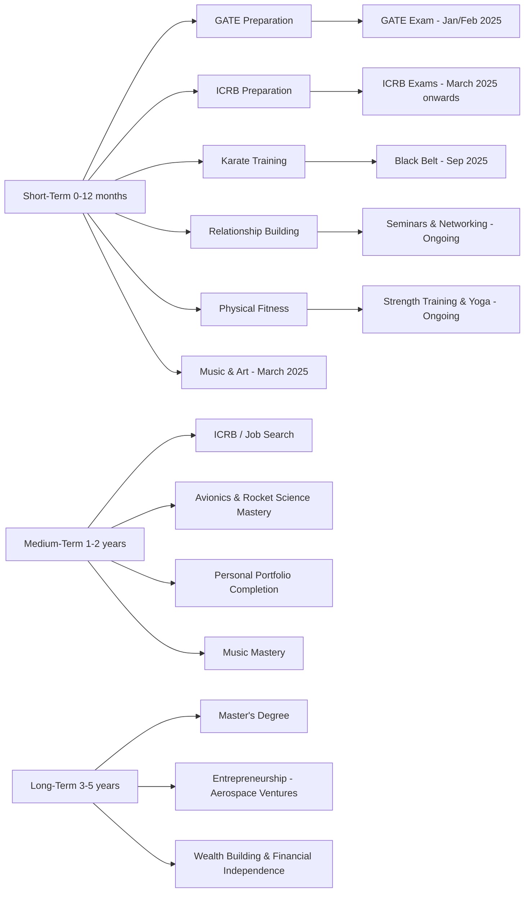

---

## **My Comprehensive Life Plan**

**Start Date:** October 1, 2024

---

# The Stardust Odyssey

## Embarking October 1, 2024

### **I. Key Focus Areas**

1. **Education & Career Development**
   - **ICRB Preparation (Priority)**
   - **GATE Preparation (Priority)**
   - Mastery of **Electronics Theory, Tools, Math, Avionics(?), and Programming** skills
   - Secure a job at **ISRO** or a **core EC/aerospace company**
   - Plan for a **Master's Degree** after saving for 2 years
   - Develop **side degrees** in **Physical Science**, **Exercise Science**, or **Nutrition Science**

2. **Health & Physical Well-being**
   - **Karate:** Achieve black belt, focusing on both physical and mental discipline
   - **Gain muscle** and maintain overall fitness
   - **Sleep optimization**: Develop healthy sleep habits
   - **Nutrition:** Create a balanced diet, meal prep, and food management

3. **Personal Projects & Technical Development**
   - **Ranga’s chip development**
   - **TVC (Thrust Vector Control) system**: Flight computer, algorithm, control systems
   - **Coil gun** with Darshine
   - **Model aircrafts**: building and piloting
   - **Raspberry Pi projects** (servers, automation, etc.)
   - Write and publish **research papers** on aerospace, health, and EC

4. **Creative & Emotional Balance**
   - **Music:** Resume and master guitar keyboard and guitar after GATE
   - **Art:** Continue drawing and sketching for creative balance
   - Explore **other creative outlets**

5. **Relationship Building & Networking**
   - Maintain and strengthen **relationships** with family and friends
   - **Expand professional network**:
     - Attend industry seminars, publish papers
     - Reach out to experts and mentors
     - Collaborate on aerospace, robotics, health, and more (for self, space robotics, and space mining ventures)

6. **Financial Independence & Wealth Management**
   - **Learn finance**: Investments, savings, and wealth multiplication
   - Develop a **fund sourcing strategy** for future ventures
   - **Financial goal**: Achieve stability within 2 years

---

### **II. Timeline with Milestones**

This timeline provides structure by categorizing goals into **short-term**, **medium-term**, and **long-term** objectives. Each includes necessary skills, progress checkpoints, rest periods, and extracurriculars like karate, music, and art for creative balance.

---

#### **1. Short-Term Goals (0-12 Months)**  

*Oct 2024 – Sep 2025*

- **GATE Preparation (Oct 2024 – Feb 2025)**  
  - 5 hours/day study, including weekends (structured study plan)
  - Weekly rest day for extracurricular activities (music, art, physical activities)
  - **Goal:** Clear GATE with competitive score (Jan/Feb 2025)

- **ICRB Preparation** (Simultaneous with GATE)
  - Allocate 2 hours/day, prioritizing post-GATE (March 2025 onwards)
  
- **Karate (Oct 2024 – Sep 2025)**  
  - Practice 3-4 times/week for 1-2 hours (mental and physical balance)
  - **Goal:** Reach advanced level (black belt by 2025)

- **Physical Fitness**  
  - Strength training 3-4 times/week (combined with karate)
  - **Rest and Recovery:** Ensure 7-8 hours of sleep nightly, schedule rest days

- **Relationship Building**  
  - Bi-weekly catch-ups with friends/family
  - Weekly connection-building activities (seminars, research collaborations)

---

#### **2. Medium-Term Goals (1-2 Years)**

*Oct 2025 – Sep 2027*

- **ICRB Exam & Job Search (2025-2026)**
  - Complete ICRB exams and apply for **ISRO** and other **EC/Aerospace roles**
  - **Goal:** Secure a position at ISRO or a core EC company by mid-2026

- **Master Electronics, Programming & Avionics (2025-2026)**  
  - Allocate time for intensive learning:  
    - 3-4 hours/week on **electronics theory**
    - 3 hours/week on **programming** (C/C++, Python, Verilog, SysVerilog)
    - 2-3 hours/week on **avionics**, **rocket science**, **embedded systems**
  - Complete projects like **model planes** and **TVC systems**

- **Ranga’s Projects** (2025-2026)  
  - Break down into sub-projects with monthly targets
  - Collaborate on **chip development**, **coil gun**, and **model planes**

- **Music & Art (Post-GATE - March 2025 onward)**  
  - Re-engage with music:  
    - 2-3 hours/week for guitar/keyboard practice  
    - Explore composition and production  
  - Continue **sketching/art** for mental clarity (at least 2 hours/week)

- **Networking Expansion (2025-2027)**  
  - Attend 3-5 industry seminars annually
  - Publish at least 2 research papers
  - Expand professional network through direct outreach and collaborations

---

#### **3. Long-Term Goals (3-5 Years)**

*Oct 2027 – Sep 2029*

- **Master’s Degree**  
  - Apply for a relevant Master’s program by 2027 (GATE, GRE, TOEFL preparation as needed)
  - **Goal:** Complete Master’s program by 2029

- **Entrepreneurial Ventures**  
  - Focus on building a foundation for an **aerospace/space robotics company** (2027 onwards)
  - Establish connections in the field of **space mining** and related technologies

- **Wealth Building & Financial Management**  
  - Achieve **financial independence** by 2027 through strategic investments
  - **Goal:** Start saving for entrepreneurial ventures (1-2 years post-job)

---

### **III. Detailed Action Plan**

1. **Education & Skills Development**
   - **Daily Study Plan**:
     - 5 hours/day for GATE + 2 hours/day for ICRB
     - Use active recall, spaced repetition, and practice exams
   - **Programming Mastery**:
     - 3 hours/week dedicated to C/C++, Verilog, Python, and embedded systems
     - Work on real-world projects (TVC, avionics systems, etc.)

2. **Health & Physical Well-being**
   - **Karate Training**:
     - 3-4 days/week practice, advancing to black belt by 2025-2026
   - **Strength Training**:
     - 3-4 days/week, focusing on muscle gain and strength based flexibility through yoga
   - **Sleep & Recovery**:
     - Establish a bedtime routine, aim for 7-8 hours of sleep/night

3. **Networking & Relationships**
   - **Monthly connection goals**:
     - Attend at least 1 seminar every 2 months
     - Reach out to 3-4 professionals/month
   - **Personal relationships**:
     - Weekly catch-ups with friends, bi-monthly family gatherings

4. **Creative Outlets**  
   - **Music & Art Practice**:
     - Dedicate 2-3 hours/week for music practice post-GATE
     - Use art as a stress relief tool, sketch 2 hours/week

---

### **IV. Comprehensive Timeline**

#### **Graphical Representation of Timeline and Connections**

---

### **V. Reminders and Affirmations**

1. **Peak human performance is a choice.**  
   Every small step forward contributes to the larger picture. Consistency is key.

2. **You have the potential to succeed.**  
   Regardless of challenges, stay disciplined and committed. You are capable of achieving greatness.

3. **Rest is as important as work.**  
   Avoid burnout. Include recovery and balance in your life to maintain long-term productivity.

4. **Stay adaptable.**  
   Life plans may shift, but flexibility will keep you moving forward toward your ultimate goals.

---
---

### *This plan is designed to keep me on track toward achieving my professional, personal, and creative aspirations. I shall stay committed, stay focused, and enjoy the process of growth!*

---
---
